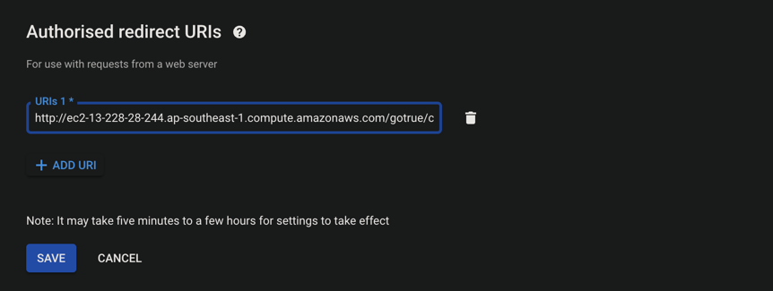
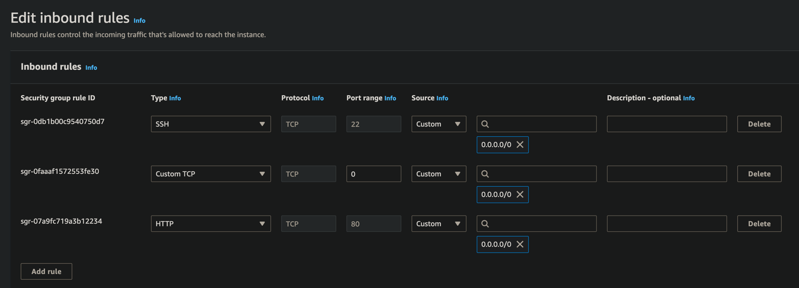
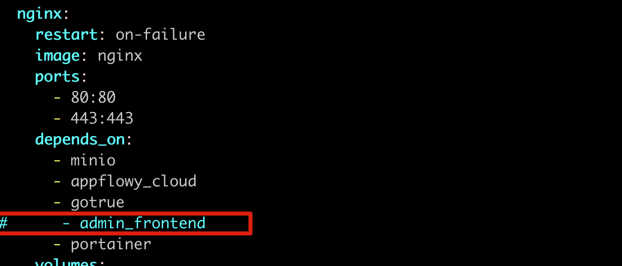

# Installing AppFlowy-Cloud on an AWS EC2 Ubuntu Instance

This guide provides a step-by-step process for setting up an EC2 instance, installing Docker on Ubuntu, and deploying AppFlowy-Cloud, along with some optional Docker maintenance commands.

Only for demonstration purposes, we will be using a free-tier EC2 instance. However, we recommend using a paid instance for production deployments.
If you have any questions, please feel free to reach out to us on [Discord](https://discord.gg/9Q2xaN37tV).

## Setting Up an EC2 Instance

1. **Launch an EC2 Instance**:
   - Visit the [Amazon EC2 console](https://console.aws.amazon.com/ec2/).
   - Select your preferred AWS Region.
   - Choose "Launch instance" from the EC2 dashboard.
   - Optionally, under "Name and tags," provide a name for your instance.
   - Under "Configure Storage", provide at least 16GB storage.
   - For "Application and OS Images (Amazon Machine Image)," select "Quick Start" and choose Ubuntu.
   - In "Key pair (login)," select an existing key pair or create a new one.
   - Review and launch the instance from the Summary panel.

## Installing Docker on Your EC2 Ubuntu Instance

1. **Update Packages**:
   ```bash
   sudo apt update
   ```

2. **Install Prerequisites**:
   ```bash
   sudo apt install apt-transport-https ca-certificates curl software-properties-common
   ```

3. **Add Docker's Official GPG Key**:
   ```bash
   curl -fsSL https://download.docker.com/linux/ubuntu/gpg | sudo apt-key add -
   ```

4. **Add Docker Repository**:
   ```bash
   sudo add-apt-repository "deb [arch=amd64] https://download.docker.com/linux/ubuntu $(lsb_release -cs) stable"
   ```

5. **Update Package Database with Docker Packages**:
   ```bash
   sudo apt update
   ```

6. **Install Docker**:
   ```bash
   sudo apt install docker-ce
   ```

7. **Check Docker Status**:
   ```bash
   sudo systemctl status docker
   ```

8. **Add User to Docker Group** (optional, to run Docker commands without `sudo`):
   ```bash
   sudo usermod -aG docker ${USER}
   ```

## Installing AppFlowy-Cloud

1. **Clone Repository**:
   Access your EC2 instance and clone the AppFlowy-Cloud repository:
   ```bash
   git clone https://github.com/AppFlowy-IO/AppFlowy-Cloud
   cd AppFlowy-Cloud
   ```

2. **Configuration Setup**:
   Create a `.env` file from the template. There will be values in the `.env` that needs to be change according to
   your needs Kindly read the comments in `.env` file.
   ```bash
   cp deploy.env .env
   ```

3. **Authentication Setup**:
    Open your .env file and update the OAuth redirect URIs with the Public IPv4 DNS of your EC2 instance. It should look something like this: http://ec2-13-228-28-244.ap-southeast-1.compute.amazonaws.com/gotrue/callback.
   As an example, when configuring OAuth credentials in Google, it should resemble the image shown below:
   

   For detailed setup instructions, refer to the Authentication documentation.

4. **Start AppFlowy Services**:
   Launch the services using Docker Compose:
   ```bash
   docker compose up -d
   ```

5. **Verify Service Status**:
   Check that all services are running:
   ```bash
   docker ps -a
   ```

## Post Install
### Exposing your AppFlowy-Cloud

After installing AppFlowy-Cloud, the server will be serving at port 80 (http) and 443 (http).
You might need to add Inbound Rule to expose the port.
- To do so, go to EC2 -> Instances -> your instance id -> Security -> Click on the Security Group
- Under Inbound Rules, Click "Edit inbound rules"
- Click "Add Rule", select either http or https(if you have configured SSL Cert)
  For example:
  
- Once done, you should be able to see the AppFlowy-Cloud admin page at `http://<your_ec2_host>/web/login`

Note: There are certain risk involved in exposing ports in your EC2 Instances, this guide is for demonstration purposes and should not be used for production.
You might want to limit IP to only trusted IP address, or use other strategies to mitigate risk.

## Configuring Environment Secrets for AppFlowy-Cloud Client

Once you've successfully set up AppFlowy Cloud on your server, the next step is to configure the environment secrets for the AppFlowy-Cloud client. These settings are crucial for the client to communicate with your self-hosted server.

1. **Verify Server Functionality**:
   - Ensure that your AppFlowy Cloud server is up and running without any issues.

2. **Copy Configuration URLs**:

   - Obtain Public IPv4 DNS: Retrieve the Public IPv4 DNS address of your EC2 instance.
     

   - Paste in Guide: Return to the [Building AppFlowy with a Self-hosted Server guide](https://docs.appflowy.io/docs/guides/appflowy/self-hosting-appflowy#step-2-building-appflowy-with-a-self-hosted-server) and paste this URL where required.
     For example, the URL might look like: `http://ec2-13-228-28-244.ap-southeast-1.compute.amazonaws.com`


## Additional Docker Commands (Optional)

These commands are helpful for Docker maintenance but use them with caution as they can affect your Docker setup.

1. **Remove All Docker Containers**:
   ```bash
   docker rm -f $(sudo docker ps -a)
   ```

2. **Restart Docker Service**:
   ```bash
   sudo systemctl restart docker
   ```

3. **Clean Up Docker (excluding volumes)**:
   ```bash
   docker system prune -af
   ```

4. **Remove Docker Volumes**:
   ```bash
   docker system prune -af --volumes
   ```

---

## Q & A

### 1.Troubleshooting Redirect Issues After OAuth Login in AppFlowy

#### Issue: Inability to Redirect to AppFlowy Application After Login with Google/GitHub/Discord

If you're encountering difficulties redirecting to the AppFlowy application after attempting to log in using Google, GitHub, or Discord OAuth, follow these steps for troubleshooting:

1. **Check OAuth Configuration for Google**:
   - Ensure `GOTRUE_EXTERNAL_GOOGLE_ENABLED` is set to `true`.
   - Verify that all other necessary Google OAuth credentials are correctly configured.

2. **Apply Similar Checks for Other OAuth Providers**:
   - Follow the same verification process for other OAuth providers like GitHub and Discord. Make sure their respective configurations are correctly set.

   The provided image illustrates the correct configuration settings.
   


### 2. Resolving the 'No Space Left on Device' Error when using free-tier EC2 instance

Encountering a 'No space left on device' error indicates that your device's storage is full. Here's how to resolve this:

#### 1. Check Disk Usage
Start by checking your disk usage. This can be done with the following command in the terminal:

```bash
df -h
```

This command will display a summary of the disk space usage on your device, as shown below:


#### 2. Clean Up Docker System
If your disk is indeed full, a quick way to free up space is by cleaning up your Docker system. Use the command:

```bash
docker system prune -af
```

**Caution:** This command removes all unused Docker images, containers, volumes, and networks. Be sure to backup any important data before proceeding.

#### 3. Modify Docker Compose Configuration
Alternatively, you can selectively reduce Docker's disk usage:

- **Disable the Tunnel Server**: Temporarily comment out or remove the tunnel server service in the `docker-compose.yml` file.

  

- **Disable Admin Frontend**: Similarly, you can disable the `admin_frontend` service in the `docker-compose.yml` file. This involves commenting out the relevant sections.

  

  Additionally, ensure that dependencies on the `admin_frontend` service are also commented out as needed.

  
